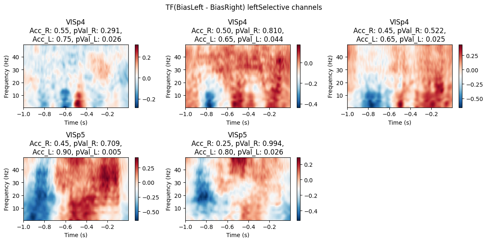
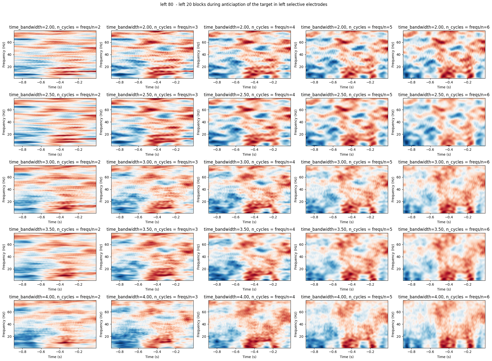

# Time Frequency Selectives

## Overview

In this Module we provide tools for computing and ploting time-frequency representations (TFR) difference between two group of trials in channels selective to right/left stimulus.

## Directory Structure

```         
Time_frequency_selectives/
│── BiasBlocks_anticip_V1.ipynb  # Example analysis notebook
│── __init__.py                   # Package initialization
│── functions/
│   ├── Bipolar.py                # Bipolar referencing functions
│   ├── csd.py                     # Current Source Density computation
│   ├── get_TFR.py                 # Compute Time-Frequency Representations
│   ├── load_decoding_results.py   # Load decoding analysis results
│   ├── plots.py                    # Visualization utilities
│   ├── __init__.py                 # Functions module initialization
```

## Usage

### 1.

**Load decoding results Use the `load_decoding_results` function to load and aggregate the decoding results for a list of sessions. And use the `selective_channels` function to get the channels selective to right/left stimulus.**

``` python
import os 
from pathlib import Path
from extraction_data import get_pid_eid_pairs
from Time_frequency_selectives import  load_decoding_results, selective_channels 

# get the pid and eid of the sessions to analyze
regionOfInterest = ['VISp'] # regions to include
pid_eid_pairs = get_pid_eid_pairs( regions = regionOfInterest,only_passive= True)

# get the decoding results
decoding_results_dir = os.path.join(str(Path(os.getcwd()).resolve().parent.parent), 'Decoding_spikes', 'results')
results = load_decoding_results(pid_eid_pairs, suffix = 'v1_TPassive_TActive' , dir = decoding_results_dir)
right_selective, left_selective, right_sensitive, left_sensitive, neutral = selective_channels(results,p_value_threshold = 0.05, accuracy_threshold = 0.57 )
```

### 2.

**Compute the Time-Frequency Representation (TFR) difference between two group of trials in channels selective to right/left stimulus ( or neutral channels).**

``` python
from Time_frequency_selectives import TF_in_one_big_job
import submitit

cpus = os.cpu_count()
BiasLeft_preprocessing = { 'tmin': -1, 'tmax': 0, 'contrasts': 'all', 'stim_side': "both", 'prob_left': [0.8], 'remove_first_trials_of_block': True, 'save': False}
BiasRight_preprocessing = { 'tmin': -1, 'tmax': 0, 'contrasts': 'all', 'stim_side': "both", 'prob_left': [0.2], 'remove_first_trials_of_block': True, 'save': False}

freqs = np.arange(1, 50, 1)
TF_parameters = {'n_cycles': freqs/5, 'time_bandwidth': 4.0, 'n_jobs': cpus}
version = 'bipolar' # or 'CSD'
file_name = f'BiasLeft_BiasRight_antic_{version}.pkl'

executor = submitit.AutoExecutor(folder="logs")
# set timeout in min, and partition for running the job
executor.update_parameters(timeout_min= 480, slurm_partition="dev", cpus_per_task = cpus, mem_gb= cpus*4 - 1.5) 
job_1 = executor.submit(TF_in_one_big_job, left_selective, BiasLeft_preprocessing, BiasRight_preprocessing, freqs, TF_parameters, version, file_name)
```

It will save the result in `\_analyses\Time_frequency_selectives\TF_data\` in a pickle file containing a list of dictionaries, each dictionary contains:

``` python
'''
        - 'TF': Time-frequency representation (2D array:  frequencies x times)
        - 'pid': Probe ID
        - 'n_trials_c1': Number of trials for condition 1
        - 'n_trials_c2': Number of trials for condition 2
        - 'ch_index': Channel index
        - 'acronym': Brain region acronym
        - 'accuracy_right': Decoding accuracy for right stim
        - 'accuracy_left': Decoding accuracy for left stim
        - 'pvalue_right': p-value for right stim
        - 'pvalue_left': p-value for left stim
        - 'freqs': Frequencies used for TFR computation
        - 'times': Time points used for TFR computation
'''
```

### 3.

**Load and Plot the results using the `plot_all_tf_by_layers` function.**

``` python
# Load the TF data.
tf_data_list = load_tf_data('path_to_the_file.pkl'))
# Plot all channels arranged by layer in one figure.
plot_all_tf_by_layers(tf_data_list,title = 'TF(BiasLeft - BiasRight) leftSelective channels', region_prefix='VISp')
```



## TF parameters

Here is the TF result for one electrode with different parameters.

